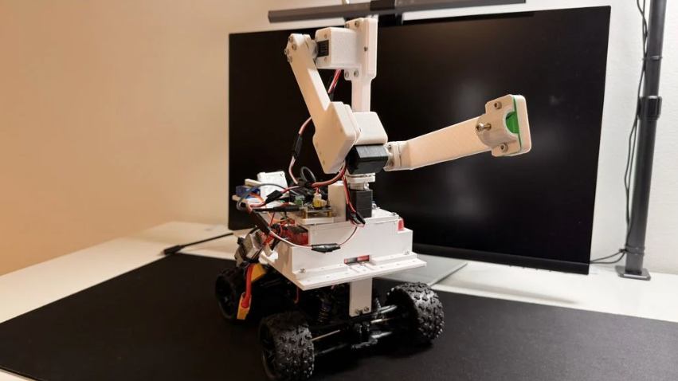
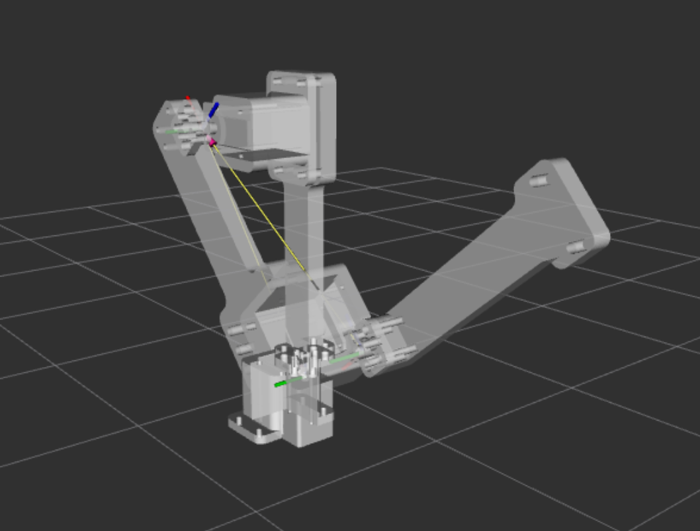
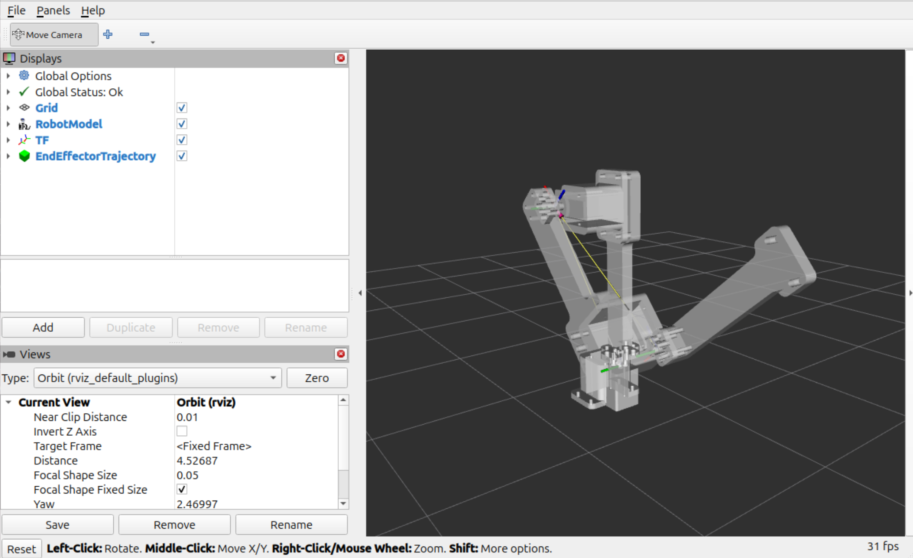
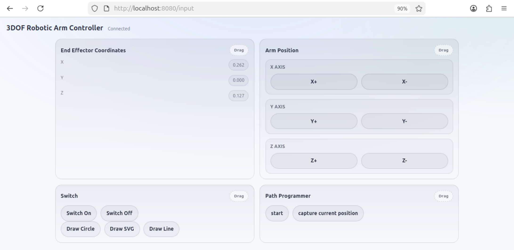

# 3dof-robotic-arm

This repository contains a ROS 2 Jazzy project for a 3-degree-of-freedom robotic arm. It supports two operating modes:

- a physical arm built from 3D-printed parts and hobby servos
- a virtual arm visualized in RViz

Both modes use the same ROS workspace and the same browser-based control interface.

## Project Overview

**Physical Robot**


**Virtual Robot**


## Requirements

- Ubuntu 24.04
- ROS 2 Jazzy-compatible environment
- a dedicated machine or virtual machine for this project

The install script sets up ROS 2 Jazzy, installs Python dependencies, and builds the workspace with `colcon`. Because it installs system packages, use a machine or VM that is reserved for this project.

## Installation

Clone the repository, then run:

```bash
./install_project.sh
```

This script:

- installs ROS 2 Jazzy
- installs the required Python packages
- builds the workspace with `colcon build`

When it finishes successfully, the workspace is ready to launch.

## Running The Project

Start the system with:

```bash
./run.sh
```

If you do not pass an argument, the script will prompt for one of these modes:

- `dummy` for the virtual robot
- `real` for the physical robot

You can also launch directly from the command line:

```bash
./run.sh dummy
./run.sh real
```

After launch, open the web interface at http://localhost:8080/input.

## Virtual Robot Mode

Run the project in `dummy` mode to start the simulated robot. RViz should open automatically and display the arm model.



Use the web interface to move the end effector in small X, Y, and Z increments. As you interact with the page, the RViz model should update immediately.

## Physical Robot Mode

If you want to build the real arm, the mechanical guide and printable files are available on Thingiverse:

https://www.thingiverse.com/thing:7348512

This hardware build is intended for educational use. Only build or operate the physical robot if you are qualified to do so safely.

Before running in `real` mode:

- assemble the robot and electronics
- connect the servo adapter board to the Ubuntu machine by USB
- make sure the device is available to the system

When `run.sh` starts in `real` mode, it installs the required `udev` rule and launches the ROS nodes for the hardware-backed controller.

You control the physical robot through the same browser UI used for the simulated robot.

## Web Interface

The browser UI is served by the ROS application at http://localhost:8080/input.



It includes four main control areas:

### End Effector Coordinates

Displays the current X, Y, and Z position of the end effector in meters, relative to the base joint.

### Arm Position

Provides buttons to move the end effector along each axis in small increments.

### Path Programmer

Lets you capture the current position as a waypoint, build a list of points, and replay that sequence later.

### Switch And Demo Actions

Provides buttons for predefined actions, including:

- switch on
- switch off
- draw circle
- draw SVG
- draw line

These actions are useful as demos and as examples of scripted robot motion.

## Repository Layout

- `install_project.sh`: installs dependencies and builds the workspace
- `run.sh`: launches the project in `dummy` or `real` mode
- `src/launcher`: ROS launch files and RViz configuration
- `src/robot_arm`: robot nodes, kinematics, web server, plotting, and servo adapters
- `docs/images`: screenshots and reference images used in this README
